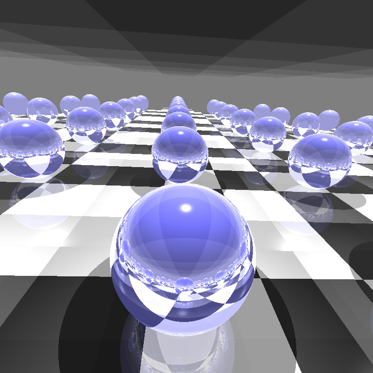
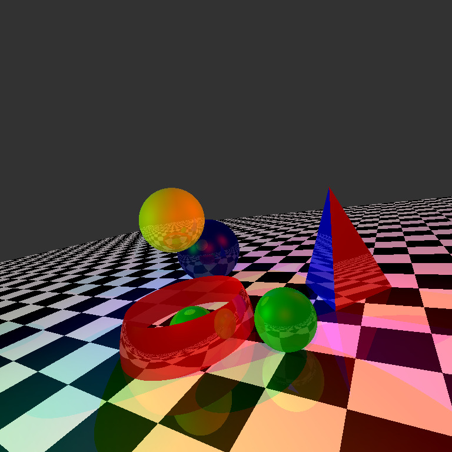

# Opengl-Raytracer-Assignment

A C++ OpenGL raytracer I wrote as part of a computer graphics course assignment. I wrote a raytracer that
- supports Spheres, Quads, General Quadratic Surfaces and  Triangles.
- supports point lights and spotlights, Ambient lights and reflection
- supports phong lighting.
- has a Vector library written from scratch.
- has a matrix library written from scratch.
- exports a raytraced bitmap image of the scene.
